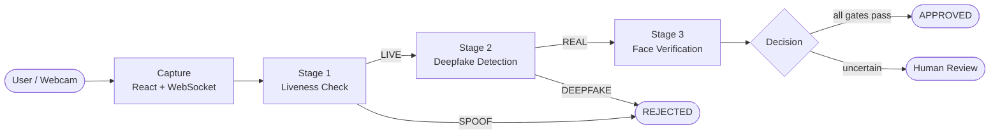

# ResilientKYC

### Defeating the Truth Attack — Next-Generation eKYC & Deepfake Defense for Digital Banking

**Powered by the FED-MEMF Architecture** — *Federated Micro-Expression Mining & Multi-Modal Metadata Fusion*

---

## Overview

Fraud has evolved beyond credential theft. With generative AI, attackers no longer
just steal passwords — they **fabricate entire believable identities**: synthetic
faces, cloned voices, and AI-generated behavior. We call this a **Truth Attack**.

For banks and fintech platforms whose trust model rests on identity verification,
legacy KYC — static document OCR, single-frame face matching, basic liveness — is
**monolithic and unimodal**: defeat one input and the whole system falls.

**ResilientKYC** replaces static document checking with **dynamic, multi-modal truth
verification**. It verifies identity across several independent signals in real time,
checks whether they agree, and preserves user privacy through federated, on-device
computation.

Three core principles:

- **Micro-Mechanics** — detect involuntary human signals (micro-expressions, gaze dynamics) that synthetic media struggles to reproduce.
- **Cross-Modal Convergence** — fuse visual, audio, and behavioral streams; a deepfake may fool one modality, but not all of them in sync.
- **Federated Privacy** — raw biometrics never leave the device; only encrypted model updates are aggregated.

---

## Architecture



The system is a **multi-gated sequential defense**. Each stage reduces risk before
the final decision; a failure at any major gate halts the pipeline. Ambiguous cases
are routed to human review rather than guessed.

---

## Repository Structure

| Folder | Stage | Description |
|--------|-------|-------------|
| [`liveness-detection/`](./liveness-detection) | 1 | Real-time anti-spoofing over WebSocket — distinguishes a live person from a photo, screen replay, or video. |
| [`deepfake-detection/`](./deepfake-detection) | 2 | The FED-MEMF cross-modal engine — visual micro-expression, audio, and metadata streams fused by cross-modal attention, with 32-frame temporal analysis. |
| [`resilient-kyc-demo/`](./resilient-kyc-demo) | — | Integrated end-to-end demonstration of the verification pipeline. |

---

## Contributors

Harshini ([@harshini0805](https://github.com/harshini0805)) built the deepfake
detection layer (`deepfake-detection/`). 
Bhavashruthi ([@Bhava-hub](https://github.com/Bhava-hub)) developed the liveness detection module
(`liveness-detection/`) and the real-time capture pipeline. 
Neha ([@neha-tp](https://github.com/neha-tp)) implemented the face verification stage that completes the verification flow.

---

## Key Features

- **Tri-modal detection** — visual (micro-expressions), audio (voice-clone artifacts), and behavioral metadata, combined by a cross-modal attention layer.
- **Temporal analysis** — 32-frame windows with smoothing catch synthetic flicker that single-frame checks miss.
- **Real-time** — sub-100ms inference per window.
- **Privacy-preserving** — federated learning keeps raw biometrics on-device.
- **Microservice architecture** — each layer runs as an independent FastAPI service.

---

## Benchmarks

FED-MEMF evaluated against standard deepfake-detection baselines:

| Model | Accuracy | AUC | FAR | Latency |
|-------|:--------:|:---:|:---:|:-------:|
| CNN-LSTM | 93.2% | 0.948 | — | 174 ms |
| XceptionNet | 91.2% | 0.921 | — | 215 ms |
| EfficientNet-B4 | 92.8% | 0.933 | — | 198 ms |
| **FED-MEMF (ours)** | **98.7%** | **0.996** | **1.04%** | **82 ms** |

---

## Tech Stack

**Frontend:** React, WebSocket (~21 FPS frame streaming)
**Backend:** Python, FastAPI, WebSocket
**ML:** PyTorch, `timm` (EfficientNet-B4), MediaPipe
**Privacy:** Federated Averaging (FedAvg), cryptographic session binding

---

## Getting Started

Each layer is a standalone service; see the README inside each folder for details.

```bash
cd deepfake-detection
pip install -r requirements.txt
python main.py            # detection API on :8000
```

---

## Roadmap

- **Phase 1** — Voice deepfake detection (multilingual voice-visual alignment).
- **Phase 2** — Blockchain-based tamper-proof identity audit logs.
- **Phase 3** — Continuous authentication throughout the session, not just at login.

---

## License

Released under the MIT License.

---

<sub>ResilientKYC — protecting not just account balances, but the trust infrastructure of the digital economy.</sub>
